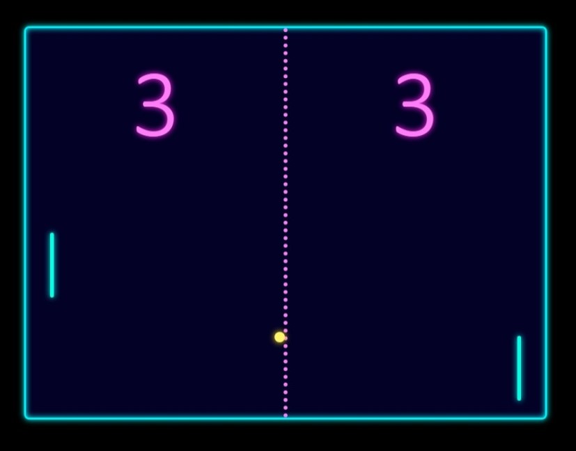

# PONG-GAME

Este es un juego de Pong desarrollado en HTML, CSS y JavaScript.

## Video de demostración

Mira el video a continuación para ver una demostración del juego:

## Descripción

PONG es un juego clásico de tenis de mesa, donde dos jugadores controlan palas para golpear una pelota y marcar puntos.

## Características

- Modos de juego: uno y dos jugadores.
- Personalización del escenario con diferentes estilos visuales: tecno, florido, neon, y loco.
- Marcador para llevar el conteo de puntos de cada jugador.

## Controles

- Jugador 1: Utiliza las teclas "A" (arriba) y "Z" (abajo) para mover la pala.
- Jugador 2: Utiliza las teclas de flecha arriba y abajo para mover la pala.

¡Disfruta jugando y comparte tus puntuaciones más altas!
